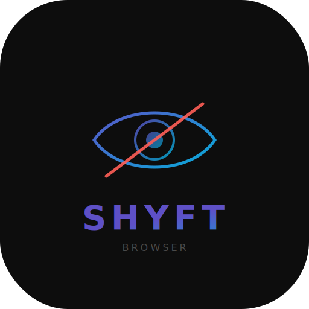

<p align="center">
  
</p>

<h1 align="center">ShyftBrowser</h1>

<p align="center">
  <strong>The browser that doesn't exist on screen sharing.</strong>
</p>

<p align="center">
  <a href="#install">Install</a> •
  <a href="#how-to-use">How to Use</a> •
  <a href="#faq">FAQ</a> •
  <a href="#contributing">Contributing</a>
</p>

<p align="center">
  
  
  
  
</p>

---

## What is this?

A browser that **only you can see**. Anyone watching your screen share sees nothing — no window, no black box, nothing.

- Press `Ctrl+S` → browser pops up instantly
- Press `Ctrl+S` again → it disappears
- Or press `s` three times quickly as an alternative
- Nobody on Zoom, Meet, Teams, or any screen recording will ever see it

That's it. Simple.

---

## Privacy

No history. No tracking. No analytics. No server. No database. No connection to anything.

Just you and your browser. **100% private.**

> Honestly, I don't even have money to host a database to collect your data even if I wanted to :D

Everything runs locally on your Mac. Nothing leaves your machine. Ever.

---

## Features

- **100% invisible** on screen sharing, screen recording, and screenshots
- **100% private** — no history, no tracking, no data collection, no servers
- **Translucent** — see your desktop behind it, adjust opacity from 10% to 100%
- **Tabs** — open multiple tabs just like a normal browser
- **Login works** — sign into any website, cookies are saved
- **Copy paste works** — Cmd+C, Cmd+V, everything
- **Always on top** — stays above all your other windows
- **No dock icon** — just a tiny `•` dot in your menu bar
- **Super lightweight** — ~2MB, no bloat

---

## Install

### Option 1: Download (easiest)
1. Go to [**Releases**](../../releases)
2. Download `ShyftBrowser.dmg`
3. Open it → Drag to Applications → Done
4. First time it opens, click **Allow** when it asks for Accessibility permission

### Option 2: Build it yourself
```bash
git clone https://github.com/yatinarora/ShyftBrowser.git
cd ShyftBrowser/Shyft
swift build -c release
open ../Shyft.app
```

---

## How to Use

**Open/Close the browser:**
> Press `Ctrl+S` — instant toggle. Works from anywhere, even if another app is focused.
> Or press `s` three times quickly as an alternative.

**Hide it fast:**
> Press `Esc`

**Keyboard shortcuts:**

| Keys | What it does |
|---|---|
| `Ctrl + S` | Show / hide browser (instant) |
| `s` `s` `s` | Show / hide browser (alternative) |
| `Esc` | Hide browser |
| `Cmd + L` | Jump to URL bar |
| `Cmd + T` | Open new tab |
| `Cmd + W` | Close current tab |
| `Cmd + Shift + ]` | Next tab |
| `Cmd + Shift + [` | Previous tab |

**Change transparency:**
> Click the `•` dot in your menu bar → pick opacity from 10% to 100%

### First time setup
When you open ShyftBrowser for the first time, macOS will ask for **Accessibility permission**. This is needed so `Ctrl+S` and `sss` hotkeys work even when other apps are focused.

**System Settings → Privacy & Security → Accessibility → Turn on ShyftBrowser**

---

## How It Works

ShyftBrowser uses native macOS window APIs to make the browser window completely invisible to the screen capture pipeline.

Anyone watching your screen share sees whatever is behind the browser window — as if it doesn't exist. No black box, no blank area, no trace.

**Tested and confirmed invisible on:**
- Zoom, Google Meet, Microsoft Teams, FaceTime, Discord
- OBS Studio, QuickTime, Loom
- macOS screenshots

---

## FAQ

**Will it really not show on Zoom/Meet/Teams?**
> Yes. It's invisible to all screen sharing and recording apps. Tested extensively.

**Does it work with all websites?**
> Yes. It's a full browser — log in, use web apps, watch videos, anything.

**Does it work on Windows or Linux?**
> No. macOS only — it relies on macOS-specific features.

**What macOS version do I need?**
> macOS 13 (Ventura) or later.

**Is it safe?**
> It's open source. Read the code yourself — there's nothing shady. It's just a browser with one special property.

---

## Contributing

Want to make it better? PRs are welcome!

1. Fork the repo
2. Make your changes
3. Open a Pull Request

**Some ideas:**
- [ ] Bookmarks bar
- [ ] Dark / light theme toggle
- [ ] Custom keyboard shortcuts
- [ ] Auto-update from GitHub releases
- [ ] Window size presets (half screen, quarter, etc.)
- [ ] Picture-in-picture mode
- [ ] Windows / Linux port

---

## License

MIT — use it however you want.

---

<p align="center">
  <strong>If this helped you, give it a ⭐</strong><br/>
  <sub>It helps others find it too.</sub>
</p>

---

<p align="center">
  <sub>invisible browser, screen sharing hidden browser, stealth browser mac, browser not visible in screen share, hidden overlay browser, transparent browser macOS, zoom invisible browser, google meet hidden browser, screen recording invisible, undetectable browser, privacy browser mac, ghost browser, phantom browser, invisible window mac, screen share proof browser, overlay browser, always on top browser, translucent browser, hidden browser for mac, browser invisible to zoom, browser invisible to obs, cheat sheet browser, secret browser mac</sub>
</p>
